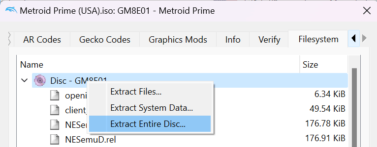
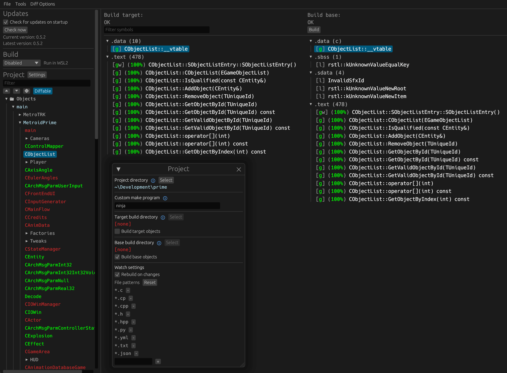

Metroid Prime [![Build Status]][actions] ![Code Progress] ![Data Progress]
=============

[Build Status]: https://github.com/PrimeDecomp/prime/actions/workflows/build.yml/badge.svg
[actions]: https://github.com/PrimeDecomp/prime/actions/workflows/build.yml
[Code Progress]: https://img.shields.io/endpoint?label=Code&url=https%3A%2F%2Fprogress.decomp.club%2Fdata%2Fprime%2FGM8E01_00%2Fdol%2F%3Fmode%3Dshield%26measure%3Dcode
[Data Progress]: https://img.shields.io/endpoint?label=Data&url=https%3A%2F%2Fprogress.decomp.club%2Fdata%2Fprime%2FGM8E01_00%2Fdol%2F%3Fmode%3Dshield%26measure%3Ddata

A work-in-progress decompilation of Metroid Prime.

This repository does **not** contain any game assets or assembly whatsoever. An existing copy of the game is required.

The following game versions are supported:

- `GM8E01_00` (USA v1.088)
<!--
- `GM8E01_01` (USA v1.093)
- `GM8E01_48` (KOR v1.097)
-->

If you'd like to contribute, see [CONTRIBUTING.md](CONTRIBUTING.md).

Dependencies
============

Windows:
--------

On Windows, it's **highly recommended** to use native tooling. WSL or msys2 are **not** required.  
When running under WSL, [objdiff](#diffing) is unable to get filesystem notifications for automatic rebuilds.

- Install [Python](https://www.python.org/downloads/) and add it to `%PATH%`.
  - Also available from the [Windows Store](https://apps.microsoft.com/store/detail/python-311/9NRWMJP3717K).
- Download [ninja](https://github.com/ninja-build/ninja/releases) and add it to `%PATH%`.
  - Quick install via pip: `pip install ninja`

macOS:
------
- Install [ninja](https://github.com/ninja-build/ninja/wiki/Pre-built-Ninja-packages):
  ```
  brew install ninja
  ```
- Install [wine-crossover](https://github.com/Gcenx/homebrew-wine):
  ```
  brew install --cask --no-quarantine gcenx/wine/wine-crossover
  ```

After OS upgrades, if macOS complains about `Wine Crossover.app` being unverified, you can unquarantine it using:
```sh
sudo xattr -rd com.apple.quarantine '/Applications/Wine Crossover.app'
```

Linux:
------
- Install [ninja](https://github.com/ninja-build/ninja/wiki/Pre-built-Ninja-packages).
- For non-x86(_64) platforms: Install wine from your package manager.
  - For x86(_64), [WiBo](https://github.com/decompals/WiBo), a minimal 32-bit Windows binary wrapper, will be automatically downloaded and used.

Building
========

- Clone the repository:
  ```
  git clone https://github.com/PrimeDecomp/prime.git
  ```
- Update and Initialize submodules:
  ```
  git submodule update --init --recursive
  ```
- Using [Dolphin Emulator](https://dolphin-emu.org/), extract your game to `orig/GM8E01_00` (or the appropriate version).  

  - To save space, the only necessary files are the following. Any others can be deleted.
    - `sys/main.dol`
    - `files/NESemuP.rel`
- Configure:
  ```
  python configure.py
  ```
  To use a version other than `GM8E01_00` (USA), specify `--version GM8E01_01` or similar.
- Build:
  ```
  ninja
  ```

Diffing
=======

Once the initial build succeeds, an `objdiff.json` should exist in the project root. 

Download the latest release from [encounter/objdiff](https://github.com/encounter/objdiff). Under project settings, set `Project directory`. The configuration should be loaded automatically. 

Select an object from the left sidebar to begin diffing. Changes to the project will rebuild automatically: changes to source files, headers, `configure.py`, `splits.txt` or `symbols.txt`.


